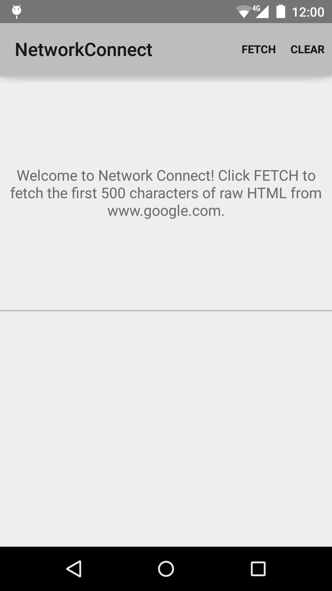

Android NetworkConnect Sample + New Relic Monitoring + AWS Device Farm
===================================

[](https://travis-ci.org/smithclay/AndroidPerfTestExample)

This sample demonstrates how to connect to the network and fetch raw HTML using
HttpURLConnection. AsyncTask is used to perform the fetch on a background thread.

New Relic is also installed along with the AWS Device Farm for automated testing.

### Pre-requisites

- Android SDK v23
- Android Build Tools v24.0.0 rc3
- Android Support Repository
- TravisCI account
- [New Relic](https://www.newrelic.com) Account
- Amazon Web Services Account

### Screenshot

 

### Getting Started

This sample uses the Gradle build system. To build this project, use the
"gradlew build" command or use "Import Project" in Android Studio.

## AWS Device Farm Setup

The AWS Command-line interface (CLI) is required.

### Create a new AWS Device Farm Project

```sh
sh $ aws devicefarm create-project --name NetworkConnect
```

### Update the Android Gradle File

Set `projectName` to the name of the Device Farm project that was creating using the CLI.

```
// Merge this with existing build.gradle
buildscript {
    repositories {
        jcenter()
        mavenCentral()
    }

    dependencies {
        classpath 'com.amazonaws:aws-devicefarm-gradle-plugin:1.0'
    }
}

apply plugin: 'devicefarm'

devicefarm {
    // The project must already exist!
    projectName "NetworkConnect"

    authentication {
        accessKey System.env.AWS_ACCESS_KEY_ID
        secretKey System.env.AWS_SECRET_ACCESS_KEY
    }

    appexplorer {}
}

```

### There are two flavors

Build flavors are used to send test data to another New Relic application (and not pollute production data with testing):

```
    productFlavors {
        prod {
            buildConfigField "String", "NEWRELIC_TOKEN", "\"AA86306d05a11be432d9edc83985f86c8e1656bb38\""
        }
        zPref {
            buildConfigField "String", "NEWRELIC_TOKEN", "\"AA3bb1c6bf2fb0ed555cd7f7149dc9e83d7032343a\""
        }
    }
```

### Run on DeviceFarm (Environment variables `AWS_ACCESS_KEY_ID` and `AWS_SECRET_ACCESS_KEY` must be set)

```
./gradlew devicefarmUpload
```
